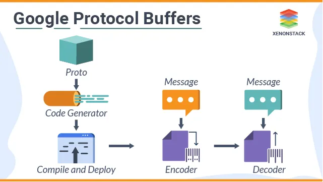

# Protocol-Buffers

نگارندگان: فرنام فرقانی، آرین ایروانی، کیان تراکمه

# بیان مسئله

در عصر نرم‌افزارهای مدرن، تبادل داده بین سیستم‌ها و سرویس‌ها به یک نیاز حیاتی تبدیل شده است. این داده‌ها باید ساختار مشخصی داشته باشند و مستقل از زبان برنامه‌نویسی یا پلتفرم، توسط طرف مقابل قابل استفاده باشند.  

## چالش‌های قالب‌های متنی متداول

روش‌های متداولی مانند **JSON** و **XML** اگرچه ساده و خوانا هستند، اما محدودیت‌هایی دارند که در مقیاس بزرگ نمود پیدا می‌کند:

- **حجم داده نسبتاً زیاد**: کلیدها و برچسب‌های تکراری باعث افزایش حجم فایل و ترافیک شبکه می‌شوند.
- **پردازش کندتر**: عملیات تجزیه و ساختاردهی داده متنی در مقایسه با قالب‌های دودویی زمان بیشتری می‌طلبد.
- **انعطاف‌پذیری محدود در تغییر ساختار**: کوچک‌ترین تغییر در قالب داده می‌تواند ناسازگاری بین نسخه‌های مختلف ایجاد کند.
- **مصرف بالاتر منابع**: در سناریوهای با پهنای باند محدود، ارسال و دریافت داده متنی بهینه نیست.

## اهمیت موضوع در معماری‌های بزرگ

در سیستم‌های توزیع‌شده (Distributed Systems)، سرویس‌های مایکروسرویس (Microservices) و ارتباطات بین‌زبانی (Cross-Language Communication)، این محدودیت‌ها می‌تواند منجر به مشکلات جدی مانند کاهش عملکرد، افزایش هزینه زیرساخت، و پیچیدگی مدیریت داده شود.

## نیاز به راهکاری بهینه و سازگار

برای رفع این چالش‌ها، نیاز به یک راهکار سریع‌تر، کم‌حجم‌تر، و با قابلیت سازگاری نسخه‌ای (Backward/Forward Compatibility) احساس شد.  
**Protocol Buffers** که توسط گوگل توسعه یافته است، دقیقاً با هدف حل این مشکلات طراحی شده و با استفاده از ساختارهای داده دودویی و تعریف شِما به زبان مستقل، امکان تبادل داده بهینه را بین سیستم‌های ناهمگون فراهم می‌کند.

# معرفی کلی

## مقدمه

**Protocol Buffers** (به اختصار **Protobuf**) یک قالب سریال‌سازی داده ساختارمند و مستقل از زبان است که توسط گوگل توسعه یافته است. این فناوری ابتدا در سال ۲۰۰۱ ایجاد شد و در سال ۲۰۰۸ به‌صورت متن‌باز منتشر گردید.  
Protobuf با هدف تبادل کارآمد داده بین سیستم‌های مختلف طراحی شده و داده‌ها را به‌صورت دودویی (Binary) ذخیره و منتقل می‌کند که این امر باعث کاهش حجم و افزایش سرعت پردازش می‌شود.

## مفهوم اساسی و فرآیند کار
در Protobuf، ساختار داده‌ها ابتدا با استفاده از یک زبان توصیفی ساده در قالب فایل‌های شِما با پسوند **`.proto`** تعریف می‌شود.  
این فایل‌ها انواع داده و فیلدها را به همراه شماره برچسب (Tag Number) مشخص می‌کنند که نقش مهمی در فشردگی داده و سرعت پردازش دارد.

سپس این شِما توسط کامپایلر مخصوص Protobuf (مانند `protoc`) به کد قابل استفاده در زبان‌های مختلف (C++، Java، Python، Go و بیش از ۲۰ زبان دیگر) تبدیل می‌شود. این فرآیند، کلاس‌ها و توابع لازم برای عملیات سریال‌سازی (Encoding) و دسریال‌سازی (Decoding) را به‌صورت خودکار ایجاد می‌کند.

## مزایای کلیدی

### ۱. کارایی بالا در حجم و سرعت
- داده‌ها در قالب دودویی فشرده ذخیره می‌شوند که حجم آن را تا حدود ۱۰ برابر کمتر از JSON و سرعت پردازش را تا ۶ برابر سریع‌تر از XML می‌کند.
- این بهینه‌سازی باعث کاهش پهنای باند مصرفی و بهبود عملکرد سیستم می‌شود.

### ۲. سازگاری نسخه‌ای (Backward/Forward Compatibility)
- امکان تغییر ساختار داده بدون شکستن سازگاری با نسخه‌های قدیمی یا جدید.
- مناسب برای توسعه تدریجی بدون ایجاد اختلال در سرویس‌های موجود.

### ۳. استقلال از زبان و پلتفرم
- Protobuf مستقل از زبان برنامه‌نویسی و پلتفرم است.
- مناسب برای معماری‌های چند‌پایانه (Multi-platform) و سیستم‌های توزیع‌شده.

### ۴. تعریف دقیق و رسمی ساختار داده
- فایل‌های `.proto` به‌عنوان منبع واحد تعریف داده، وضوح و قابلیت نگهداری بالاتری را برای پروژه‌ها فراهم می‌کنند.

## کاربردهای اصلی
- سرویس‌های وب و APIها (از جمله **gRPC**).
- سیستم‌های مایکروسرویسی و ارتباطات بین سرویس‌ها.
- اپلیکیشن‌های موبایل و سرویس‌های ابری.
- سیستم‌های پیام‌رسانی (Message Queuing).
- ذخیره‌سازی داده در پایگاه داده یا فایل.

Protobuf امروزه به‌عنوان یک استاندارد کارآمد و قابل اعتماد برای تبادل داده در مقیاس بزرگ شناخته می‌شود و شرکت‌هایی مانند گوگل، Netflix و Uber از آن در مقیاس وسیع استفاده می‌کنند.

# مثال

# مراجع

* [Google Developers — *Protocol Buffers Overview*](https://developers.google.com/protocol-buffers/docs/overview)
* [Google Developers — *Encoding*](https://developers.google.com/protocol-buffers/docs/encoding)
* [Wikipedia — *Protocol Buffers*](https://en.wikipedia.org/wiki/Protocol_Buffers)
* [Baeldung — *Introduction to Google Protocol Buffers*](https://www.baeldung.com/google-protocol-buffers)